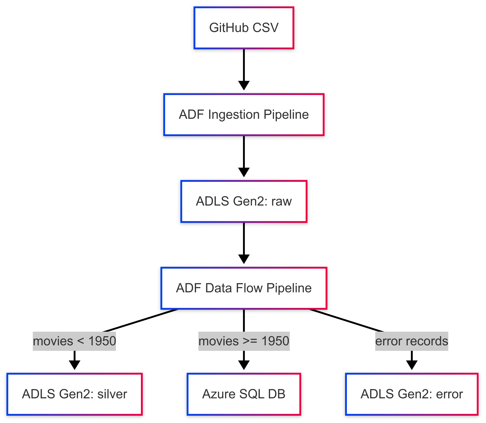
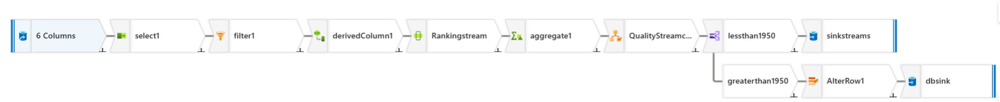

# Architecture Overview

## Solution Components

- **Azure Data Factory (ADF):** Orchestrates the end-to-end data pipeline, including ingestion, transformation, and loading.
- **Azure Data Lake Storage Gen2 (ADLS):** Stores raw, archived, and processed (silver) data files.
- **Azure SQL Database:** Stores curated movie data for analytics and reporting.

---

## Data Flow

1. **Ingestion Pipeline**
   - **Source:** Public GitHub CSV file (`moviesDB.csv`)
   - **Sink:** ADLS Gen2 `raw` folder
   - **ADF Pipeline:** `df_moviesdb_ingestion_pipeline`

2. **Transformation Pipeline**
   - **Source:** ADLS Gen2 `raw` folder
   - **Transformations:** Column renaming, filtering, genre simplification, ranking, aggregation, validation, and routing
      - **Sinks:**
     - ADLS Gen2 `silver` folder (for movies before 1950)
     - Azure SQL Database (for movies from 1950 onwards)
     - ADLS Gen2 `error` folder (for records failing validation)
   - **ADF Data Flow:** `df_transform_moviesdb`
   - **ADF Pipeline:** `df_movesdb_transform_pipeline`

---

## Logical Architecture Diagram

---

## Data Flow Transformation Diagram

